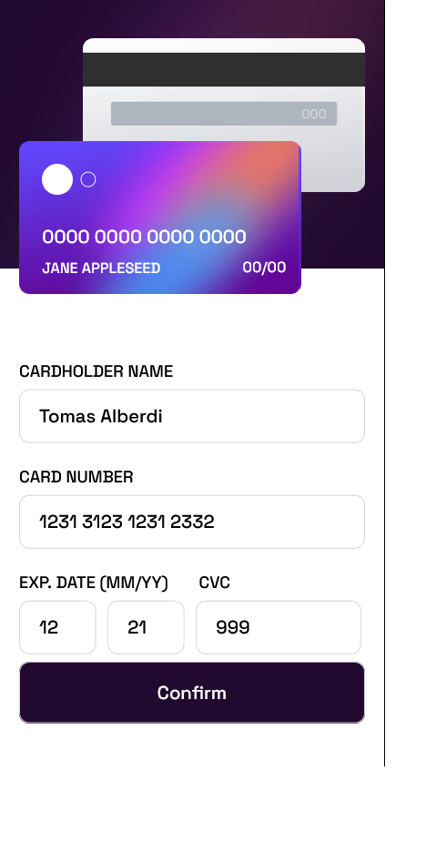
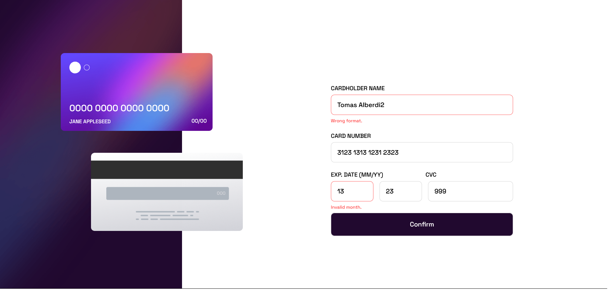

# Frontend Mentor - Interactive card details form solution

This is a solution to the [Interactive card details form challenge on Frontend Mentor](https://www.frontendmentor.io/challenges/interactive-card-details-form-XpS8cKZDWw). Frontend Mentor challenges help you improve your coding skills by building realistic projects. 

## Table of contents

- [Overview](#overview)
  - [The challenge](#the-challenge)
  - [Screenshot](#screenshot)
  - [Links](#links)
- [My process](#my-process)
  - [Built with](#built-with)
  - [What i learned](#what-i-learned)
- [Author](#author)

## Overview

### The challenge

Users should be able to:

- Fill in the form and see the card details update in real-time
- Receive error messages when the form is submitted if:
  - Any input field is empty
  - The card number, expiry date, or CVC fields are in the wrong format
- View the optimal layout depending on their device's screen size
- See hover, active, and focus states for interactive elements on the page

### Screenshot






### Links

- Solution URL: [GitHub Repository](https://github.com/TomyAlberdi/Interactive-Card-Details-Form)
- Live Site URL: [Live Site](https://tomyalberdi.github.io/Interactive-Card-Details-Form/)

## My process

### Built with

- Mobile-first workflow
- Sass
- Flexbox

### What I learned

```js
let mmValidation = () => {
    let val = inputMM.value
    let result = /^(0[1-9]|1[0-2])$/.test(val);
    if (!result) {
        let error = errorCard("Invalid month.")
        numberDiv.after(error)
        inputMM.classList.add("notValid")
        pass = false
    }
}
```
## Author

- Website - [Tomás Alberdi](https://tomyalberdi.github.io/portfolio/)
- Frontend Mentor - [@TomyAlberdi](https://www.frontendmentor.io/profile/TomyAlberdi)